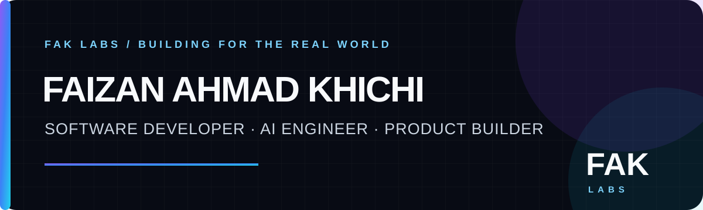

# Faizan Ahmad Khichi

### Founder & CEO of FAK LABS · Software Developer · AI Engineer · Product Builder

**I turn ambitious ideas into useful, production-ready digital products.**

Based in Pakistan · Building for a global audience · Open to selected collaborations

   

---

## Start here

I independently design, build, deploy and improve software across **AI, automation, cybersecurity, mobile, cloud infrastructure and the modern web**. My production repositories are mostly private, so this profile focuses on public products you can evaluate directly.

| If you want to… | Start with… |
| --- | --- |
| Explore my strongest work | [Official portfolio](https://portfolio.faizankhichi.me/) |
| Use my browser tools | [FAK LAB](https://faizankhichi.me/) |
| Discuss a project | [LinkedIn](https://www.linkedin.com/in/faklabs/) or [Fiverr](https://www.fiverr.com/faklabs) |
| Follow product development | Follow this GitHub profile and watch the pinned repositories |

## What I build

- **AI & automation:** intelligent workflows, assistants, APIs and task automation
- **Full-stack products:** accessible, responsive web applications and browser tools
- **Cloud systems:** edge deployments, serverless services and scalable backends
- **Android experiences:** mobile-first utilities designed for real-world constraints
- **Security & forensics:** responsible OSINT, privacy and digital-analysis workflows

## Featured products — try them live

| Product | Purpose | Explore |
| --- | --- | --- |
| **FAK LAB** | Security, OSINT, developer, image, document and everyday browser tools | [Open platform →](https://faizankhichi.me/) |
| **FAK LAB MUSIC** | Cloud-powered music discovery and streaming | [Listen now →](https://music.faizankhichi.me/) |
| **Islamic Portal** | Quran, Hadith, prayer times, duas and daily resources | [Visit portal →](https://quran.fakcloud.tech/) |
| **Poster Maker Pro** | A browser-based visual design and poster workspace | [Start designing →](https://faizankhichi.me/poster/) |
| **AllDL** | Public-media download workflows across supported platforms | [Open AllDL →](https://alldl.faizankhichi.me/) |

## Technology toolkit

  
  
  
  
  
  
  
  
  
  

## Why follow?

Follow my GitHub for new product launches, engineering case studies, open-source utilities and practical experiments from FAK LABS. I care about software that is useful, fast, accessible and ready for real users—not disconnected demos.

## How I work

- Own the complete journey from product idea and interface to deployment
- Design for phones, limited bandwidth and real-world operating conditions
- Keep private systems private while making public work easy to evaluate
- Improve through testing, feedback and measurable use

---

### Have an idea worth building?

[**See my work**](https://portfolio.faizankhichi.me/) · [**Connect on LinkedIn**](https://www.linkedin.com/in/faklabs/) · [**Hire me on Fiverr**](https://www.fiverr.com/faklabs) · [**Explore FAK LABS**](https://github.com/FAK-LABS)

*Building useful technology from Pakistan for the world.*

